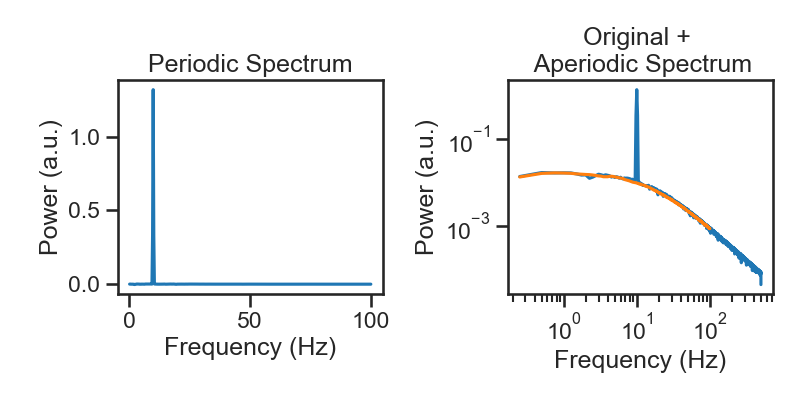

# PyRASA - Spectral parameterization in python based on IRASA

[](https://www.repostatus.org/#wip)
[](https://opensource.org/licenses/BSD-2-Clause)
[](http://mypy-lang.org/)
[](https://coveralls.io/github/schmidtfa/pyrasa?branch=main)


PyRASA is a Python library designed to separate and parametrize aperiodic (fractal) and periodic (oscillatory) components in time series data based on the IRASA algorithm (Wen & Liu, 2016).

### Features
- **Aperiodic and Periodic Decomposition:** Utilize the IRASA algorithm to decompose power spectra into aperiodic and periodic components, enabling better interpretation of neurophysiological signals.
- **Time Resolved Spectral Parametrization:** Perform time resolved spectral parametrizazion, allowing you to track changes in spectral components over time.
- **Support for Raw and Epoched MNE Objects:** PyRASA provides functions designed for both continuous (Raw) and event-related (Epochs) data, making it versatile for various types of EEG/MEG analyses.
- **Consistent Ontology:** PyRASA uses the same jargon to label parameters as specparam, the most commonly used tool to parametrize power spectra, to allow users to easily switch between tools depending on their needs, while keeping the labeling of features consistent.
- **Custom Aperiodic Fit Models:** In addition to the built-in "fixed" and "knee" models for aperiodic fitting, users can specify their custom aperiodic fit functions, offering flexibility in how aperiodic components are modeled.


## Documentation
Documentation for PyRASA, including detailed descriptions of functions, parameters, and tutorials is available [here](https://schmidtfa.github.io/pyrasa/index.html).


### Installation
To install the latest stable version of PyRASA, you can soon use pip:

```bash
$ pip install pyrasa
```

or conda

```bash
$ conda install pyrasa 
```

### Dependencies

PyRASA has the following dependencies:
- **Core Dependencies:**
  - [numpy](https://github.com/numpy/numpy)
  - [scipy](https://github.com/scipy/scipy)
  - [pandas](https://github.com/pandas-dev/pandas)

- **Optional Dependencies for Full Functionality:**
  - [mne](https://github.com/mne-tools/mne-python): Required for directly working with EEG/MEG data in `Raw` or `Epochs` formats.


### Example Usage

Decompose spectra in periodic and aperiodic ccomponents

```python
from pyrasa.irasa import irasa

irasa_out = irasa(sig, 
                    fs=fs, 
                    band=(.1, 200), 
                    psd_kwargs={'nperseg': duration*fs, 
                                'noverlap': duration*fs*overlap
                                },
                    hset_info=(1, 2, 0.05))

```



Extract periodic parameters

```python

irasa_out.get_peaks()

```
|   ch_name |   cf |      bw |     pw |
|----------:|-----:|--------:|-------:|
|         0 |  9.5 | 1.4426 | 0.4178 |

Extract aperiodic parameters

```python

irasa_out.fit_aperiodic_model(fit_func='knee').aperiodic_params

```

|   Offset |   Knee |   Exponent_1 |   Exponent_2 | fit_type   |   Knee Frequency (Hz) |   tau |   ch_name |
|---------:|-------:|-------------:|-------------:|:-----------|----------------------:|----------:|----------:|
|  	1.737402e-16 | 60.942144 |     0.039556 |      1.472746	 | knee       |               14.131277 |         0.011263 |         0 |

And the goodness of fit

```python

irasa_out.fit_aperiodic_model(fit_func='knee').gof

```

|         mse |   r_squared |      BIC |      AIC | fit_type   |   ch_name |
|------------:|------------:|---------:|---------:|:-----------|----------:|
| 0.000051 |    0.999751 | -3931.840246 | -3947.806104 | knee       |         0 |


### How to Contribute

Contributions to PyRASA are welcome! Whether it's raising issues, improving documentation, fixing bugs, or adding new features, your help is appreciated. 

To file bug reports and/or ask questions about this project, please use the [Github issue tracker](https://github.com/schmidtfa/pyrasa/issues).

Please refer to the [CONTRIBUTING.md](https://github.com/schmidtfa/pyrasa/blob/main/CONTRIBUTING.md) file for more information on how to get involved.


### Reference

If you are using IRASA please cite the smart people who came up with the algorithm:

Wen, H., & Liu, Z. (2016). Separating fractal and oscillatory components in the power spectrum of neurophysiological signal. Brain topography, 29, 13-26. https://doi.org/10.1007/s10548-015-0448-0

If you are using PyRASA it would be nice, if you could additionally cite us (whenever the paper is finally ready):

Schmidt F., Hartmann T., & Weisz, N. (2049). PyRASA - Spectral parameterization in python based on IRASA. SOME JOURNAL THAT LIKES US